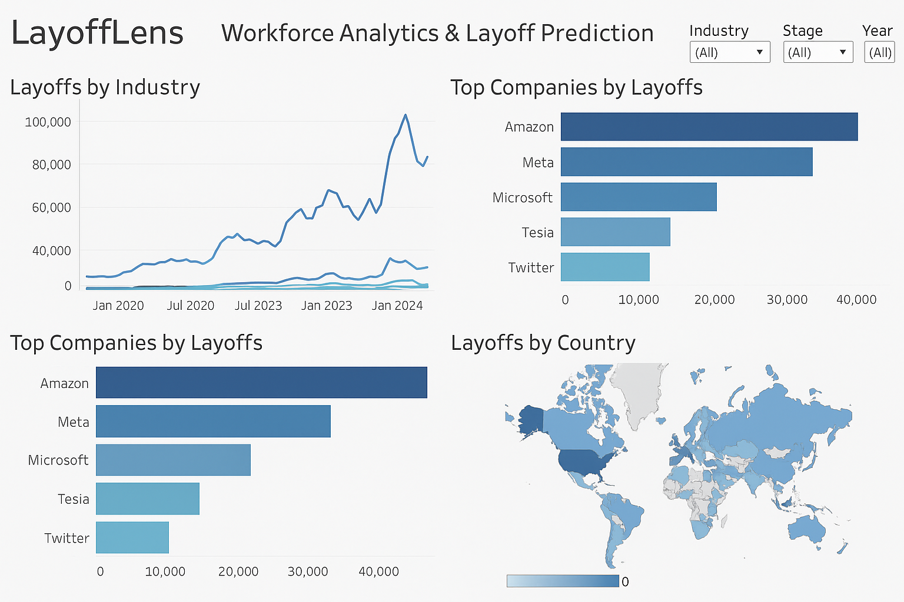

## 💼 LayoffLens – Workforce Analytics & Layoff Prediction

### A full-stack data project analyzing layoff trends and predicting workforce reductions using **SQL**, **Python**, **Tableau**, and **AWS**. From raw CSV data to insightful dashboards and an interpretable ML model, LayoffLens helps uncover hidden workforce trends.


## 📂 Project Structure

```
LayoffLens/
│
├── data/
│   └── layoffs.csv
│
├── notebooks/
│   ├── data_cleaning.ipynb         # Python-based EDA & preprocessing
│   └── model_training.ipynb        # XGBoost model training + SHAP
│
├── scripts/
│   ├── etl_pipeline.py             # AWS S3-based ETL pipeline
│   └── sql/
│       ├── clean_data.sql          # Raw data cleaning using SQL
│       └── trend_analysis.sql      # SQL-based exploratory analysis
└── README.md
```


## 🔍 Key Features

### 📌 Data Engineering & Cleaning

* Loads layoff data from CSV into MySQL or Python pandas.
* Cleans and standardizes data using both SQL (`clean_data.sql`) and Python (`data_cleaning.ipynb`).
* Supports transformation pipelines with AWS S3 via `etl_pipeline.py`.

### 📊 Exploratory SQL Analysis

* Deep dive into trends by industry, company stage, geography, and year/month.
* Uses advanced SQL: CTEs, window functions, rankings, and aggregations.
* Trend insights exported to Tableau for BI dashboards.

### 🤖 Predictive Modeling

* Built an **XGBoost classifier** (\~91% accuracy) to predict layoffs.
* Used **SHAP** for model interpretability and feature impact analysis.
* Visualized confusion matrix and feature importance.

### 📈 Business Intelligence

* Tableau dashboard with filters for:

  * Industry trends over time
  * Top affected companies
  * Layoffs by country or funding stage


## ⚙️ Setup Instructions

### Prerequisites

* Python 3.8+
* MySQL 8.0+ (for SQL scripts)
* AWS CLI + credentials (for S3 integration)
* Tableau Desktop (optional)
* Python packages in `requirements.txt`

### Setup Steps

```bash
git clone https://github.com/Priyanshu-Builds/LayoffLens.git
cd LayoffLens
pip install -r requirements.txt
```


## 🧪 Run the Pipeline

### 1. SQL Workflow:

* Run `scripts/sql/clean_data.sql` to ingest and clean CSV data.
* Run `scripts/sql/trend_analysis.sql` to extract insights for Tableau.

### 2. Python Workflow:

* Use `notebooks/data_cleaning.ipynb` to explore and clean data.
* Use `notebooks/model_training.ipynb` to train the ML model.
* Use `scripts/etl_pipeline.py` to upload cleaned data to AWS S3.


## 📊 Sample Insights (via SQL & Tableau)

* 📉 **Industries hit hardest:** Tech, Retail, and Fintech.
* 🧭 **Geographies most affected:** US and UK.
* 🏢 **Top companies with highest layoffs in 2023.**
* 📆 **Trends:** Spike in layoffs during Q1 2023, recovery visible in late 2024.


## 🔮 Model Insights (via Python & SHAP)

* `percentage_laid_off`, `company_stage`, and `industry` were top predictors.
* SHAP values revealed that early-stage startups are more vulnerable.
* Dashboard storytelling supported business planning decisions.


## 📌 Future Enhancements

* Real-time data pipelines with Apache Airflow
* Deploy model via Flask + AWS Lambda
* Extend BI to Power BI or Streamlit
